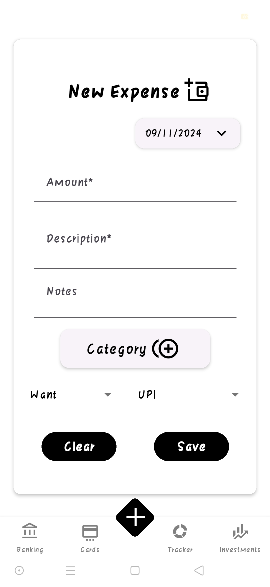
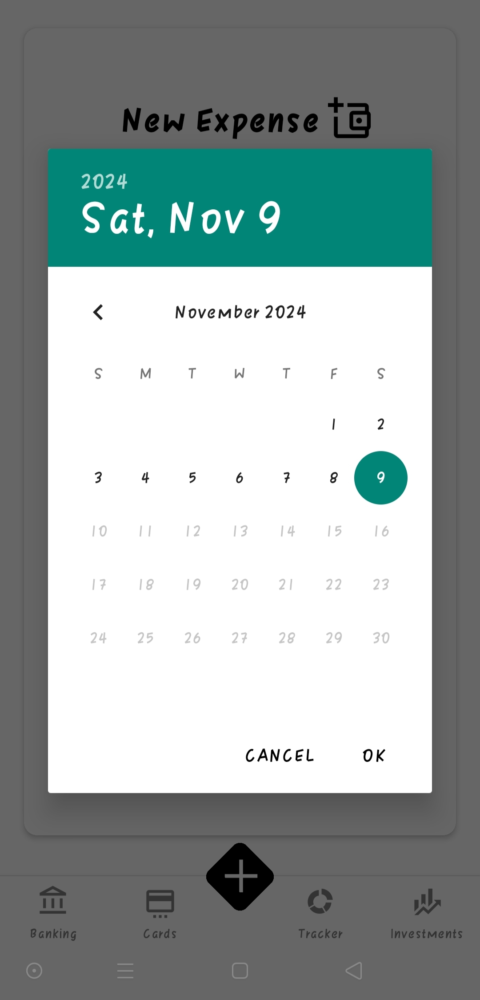
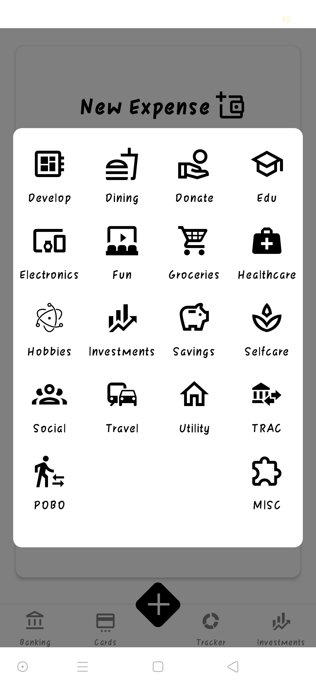
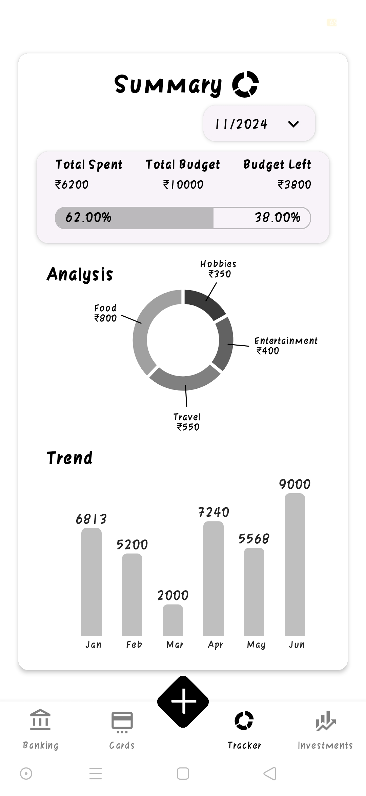
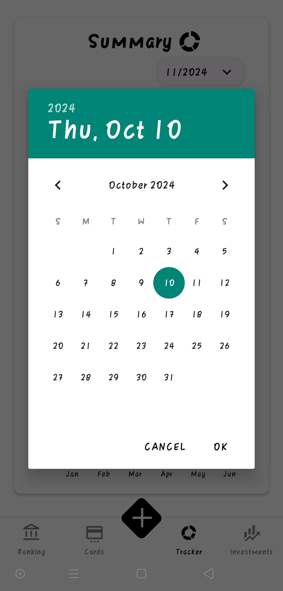
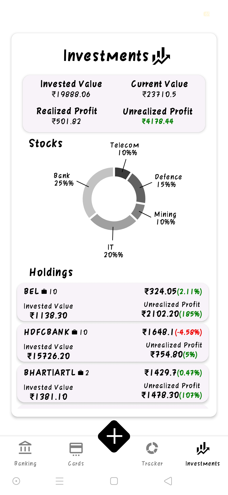
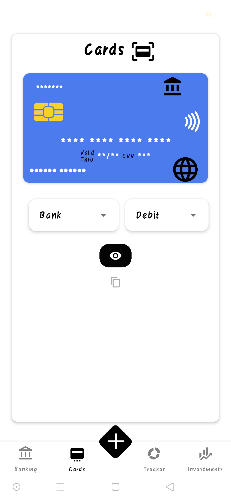
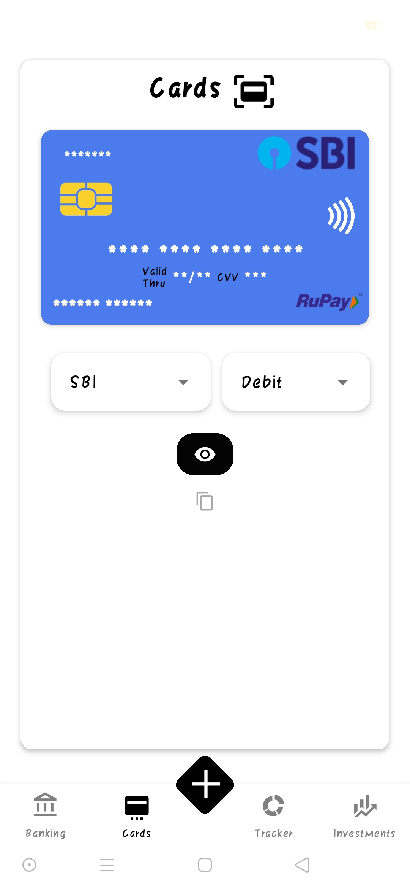
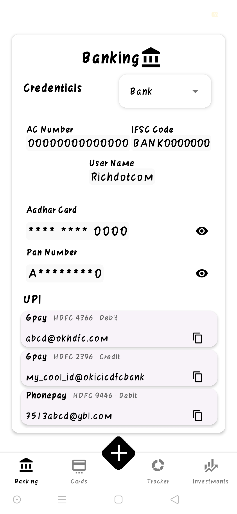

    

<h1 align="center">
    BitWault
</h1>
<h3 align="center">
    Personal Expense Tracker for Android   <a href="https://youtu.be/8o-5a1XjGV4">Video demo</a>
</h3>

BitWault is a simple finance tracker app, with the main purpose of monitoring and documenting expenses. The intial idea was to develop an application which allows the user to record the expenses they made. It was further expanded to include a screen to give some simple insights into monthly spending and trends over the past six months. Later, some more additions like tracking stock holdings of the user, credit card details and banking information such as UPI IDs etc.   

## Features
Currently, BitWault consists of five main screens, each serving a specific purpose:
* Add Expenses - This screen has a form that allows users to input their expenses into the database.
* Summary - This insights screen displays budget information and categorizes expenses for the current month, along with expense trends over the last six months.
* Investments Tracker - This data screen shows the current value of the user's holdings, along with profits, losses, and sector-wise investments.
* Cards - This simple screen consolidates all card-related information, including card numbers, expiration dates, and CVV codes.
* Banking - This screen contains banking data such as UPI IDs and other miscellaneous information.

### Tech Stack:
* Frontend - React Native with Expo Cli
* Backend - Google Spreadsheets with AppScript

## Screenshots
<b> Add Expenses</b> 
 
<b> Summary </b> 
 
<b> Investments Tracker </b> 
 
<b> Cards </b> 
 
<b> Banking </b> 
 

## Development
* Visit the Eas Build Documentation for this project, on how to get started with the basic setup [Eas Build Info](./EasBuildInfo.md).
* Utlize the code in the branch `anymz_code` [here](https://github.com/Ruthvik-1411/Finance_Tracker_app/tree/anymz_code) to get the most recent and optimized code. The code in this branch is anonymized and all references to the backend endpoint are removed. So feel free modify the code and utilize your own logic if you want to build the application for your use.
## License
This project is licensed under the MIT License. Feel free to modify and distribute the app as per the terms of the license. The branch `demo_frontendApplication` is a demo version of the code and can be used as a starting point or elements of it can be reused to build on top of this. This branch can be downloaded and can be used to get a eas build.
